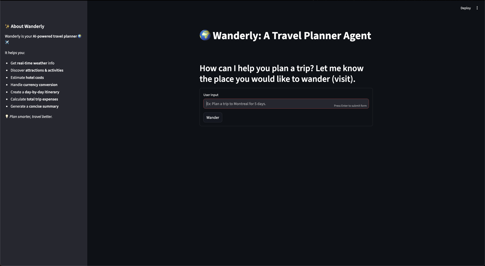
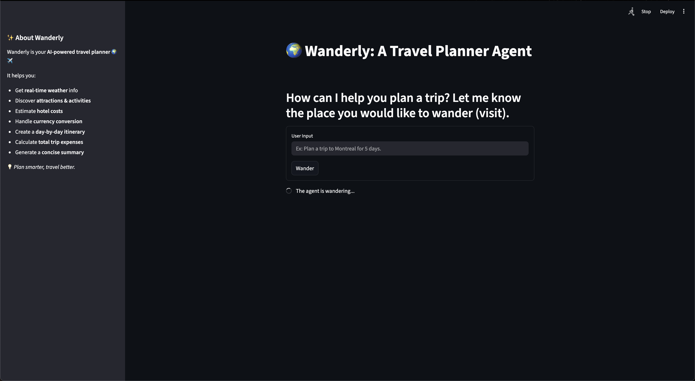
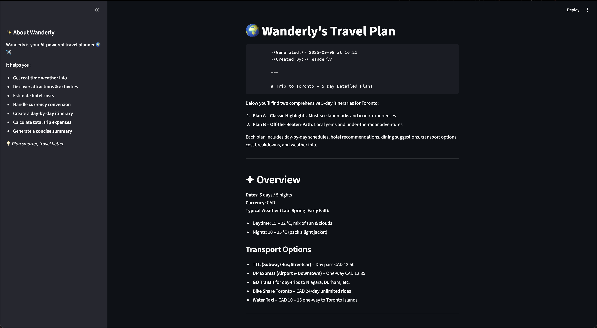

# 🌍 Wanderly – AI Trip Planner  

*Plan smarter, wander further.*  

Wanderly is an **AI-powered trip planner** that helps users design personalized itineraries for any destination worldwide.  
It integrates **real-time data** on weather, attractions, activities, hotels, and currency exchange, while automatically building an itinerary, estimating costs, and summarizing the trip using an LLM.  

---

## ✨ Features  

- **🗺️ Personalized Itinerary** – Plan trips tailored to your destination and duration.  
- **🌦️ Real-Time Weather** – Current conditions and 5-day forecast via OpenWeather Map.  
- **🏛️ Attractions & Activities** – Recommendations for top sights, restaurants, and local experiences.  
- **💵 Currency Conversion** – Real-time exchange rates with Exchangerate API.  
- **📊 Cost Estimation** – Automatic budget calculations including hotels, food, attractions, and transport.  
- **📝 Downloadable Plan** – Export trip details as a Markdown file from the Streamlit app.  
- **🤖 AI Summaries** – Itinerary and cost breakdown summarized using **OpenAI GPT-4o-mini**.  

---

## 🛠️ Architecture & Flow  

1. **User Input** – Query includes destination and trip duration.  
2. **Agent Orchestration** – LangGraph + LangChain coordinate tool usage.  
3. **Data Retrieval**:  
   - Google Places API – Attractions, restaurants, activities, transport.  
   - OpenWeather Map – Current weather and forecast.  
   - Exchangerate API – Currency conversion.  
   - Google Search – Average cost data for restaurants, activities, attractions, and transportation.  
4. **Computation** – Arithmetic tools calculate budgets and expenses.  
5. **AI Summarization** – LLM synthesizes findings into a final itinerary.  
6. **Presentation** – Results returned via FastAPI (`/query`) and displayed in Streamlit with a **download button**.  

---

## 🛠️ Tech Stack  

- **Frontend**: [Streamlit](https://streamlit.io/) for a modern, interactive UI.  
- **Backend**: [FastAPI](https://fastapi.tiangolo.com/) exposing the `/query` endpoint.  
- **Agents & Orchestration**: [LangGraph](https://www.langchain.com/langgraph) + [LangChain](https://www.langchain.com/).  
- **LLM**: [OpenAI GPT-4o-mini](https://platform.openai.com/).  
- **APIs**:  
  - Google Places API  
  - OpenWeather Map  
  - Exchangerate API  
  - Google Search (for cost data)  
- **Validation**: [Pydantic](https://docs.pydantic.dev/) for structured responses.  
- **Environment & Packaging**: [uv](https://github.com/astral-sh/uv).  
- **Server**: [Uvicorn](https://www.uvicorn.org/) for FastAPI.  

---

## 🎬 Demo Video  

You can watch the demo [here](https://youtu.be/Q1cPVnjCMys)  

---

## 📸 Screenshots  

| Home Page | Itinerary Planning | Itinerary Planned |  
|--------------|-------------------|-----------------------|  
|  |  |  |  

---

## ⚙️ Setup  

This project uses [uv](https://github.com/astral-sh/uv) for dependency management.  

### 1. Clone the repository  
```bash
git clone https://github.com/adparekh/wanderly.git
cd wanderly
```

### 2. Install dependencies

Using `uv`:

```bash
uv sync
```

Or using `setup.py` (requires `requirements.txt`):

```bash
python setup.py
```

### 3. Add API keys

Create a `.env` file and include all required API keys (More information in  `.env.name `):

- `OPENAI_API_KEY`
- `GOOGLE_PLACES_API_KEY`
- `OPENWEATHER_API_KEY`
- `EXCHANGERATE_API_KEY`

### 4. Start FastAPI backend

```bash
uvicorn api.wander:app --reload --port 8000
```

Backend will run at: `http://localhost:8000/query`

### 5. Run Streamlit frontend

```bash
streamlit run app.py
```

---

## 💡 Usage Tips

1. **Enter clear queries** – Include **destination** and **number of days**.  
2. **Download your plan** – Use the download button at the bottom to export results.  
   👉 Example available at [`sample_trip_plan.md`](./sample_trip_plan.md).  

---

## 🔮 Future Improvements

- ✈️ Integration with live flight booking APIs.
- 🏨 Direct hotel booking support.
- 📍 Offline mode for downloaded itineraries.
- ⚡ Streaming responses for partial results in real time.
- 📊 Comparison dashboard for multiple trip options.

---

## 📂 Project Structure

```bash
wanderly/
│── agent/                 # Multi-agent orchestration and logic  
│── api/  
│   └── wander.py          # FastAPI backend with /query endpoint  
│── configs/               # API keys, environment settings  
│── prompts/               # LLM prompt templates  
│── tools/                 # API integrations (Places, Weather, Currency, Search)  
│── utils/                 # Helper functions and utilities  
│── app.py                 # Streamlit frontend  
│── setup.py               # Setup script  
│── pyproject.toml         # Project configuration and dependencies  
│── requirements.txt       # Dependency list  
│── .env.name              # API keys and environment variables
```

